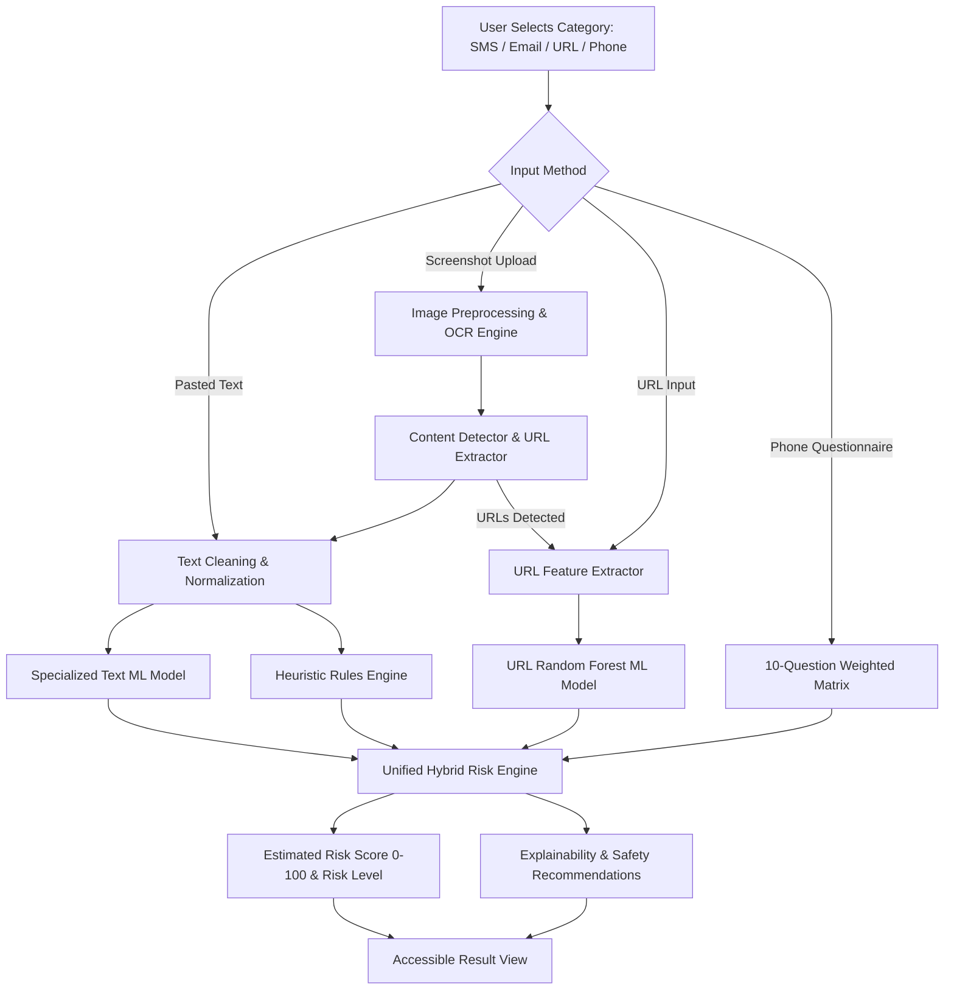
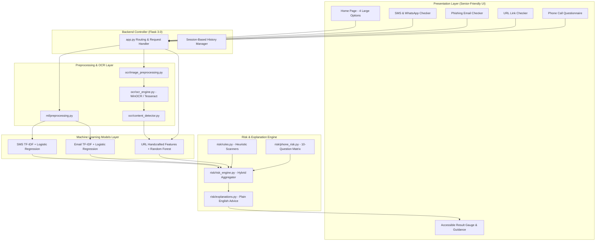

# ScamShield: AI-Based Scam Detection and Risk Assessment System

> **A Hybrid Machine Learning Web Application for Scam Prevention and Risk Assessment**  
> *Designed specifically for older adults, non-technical users, and general smartphone owners.*

[](https://www.python.org/)
[](https://flask.palletsprojects.com/)
[](https://scikit-learn.org/)
[](LICENSE)
[]()

---

## 1. Project Title
**SCAMSHIELD: AI-Based Scam Detection and Risk Assessment System**

## 2. Project Overview
ScamShield is an end-to-end Machine Learning web application designed to help non-technical users and older adults detect and evaluate potential scam attempts across multiple digital channels:
1. **SMS & WhatsApp Messages** (Copy/paste text or upload screenshots)
2. **Phishing Emails** (Subject, body, sender address, or screenshots)
3. **Suspicious URLs & Website Links** (Pre-click lexical & structural analysis)
4. **Suspicious Phone Calls** (10-question behavioral risk questionnaire)

The primary goal of ScamShield is **PREVENTION**—empowering users to verify suspicious interactions **before** they click links, share One-Time Passwords (OTPs), provide banking details, transfer funds, or install unknown remote-access software.

---

## 3. Problem Statement
Digital fraud, social engineering, smishing, and phishing attacks have grown exponentially, disproportionately impacting older adults and non-technical smartphone users. Existing security tools often feature complex dashboards, technical jargon, or invasive real-time monitoring. Users lack a lightweight, accessible, privacy-friendly safety tool that explains *why* content is suspicious in plain English and gives immediate, actionable safety advice.

---

## 4. Objectives
- **Multi-Vector Threat Analysis**: Provide dedicated, specialized machine learning classifiers for SMS, Email, and URL content.
- **Hybrid Risk Assessment Engine**: Synthesize ML classification probabilities with rule-based heuristics and embedded URL risk scores into a unified 0–100 Estimated Risk Score.
- **OCR Screenshot Pipeline**: Enable users to upload screenshots directly from smartphones and chat apps, automatically extracting text and embedded links without needing a separate model.
- **Senior-Friendly HCI & Accessibility**: High contrast, readable typography, large click/touch targets, and plain-language reasoning ("Why Did We Give This Score?" and "What Should You Do Now?").
- **Privacy & Safety First**: Local processing, non-permanent upload handling, and pre-click safe URL parsing without navigating to dangerous websites.

---

## 5. Key Features
- **4 Large Primary Check Options**: One-click navigation to SMS, Email, URL, or Phone Call checks.
- **Dual Input Methods**: Support for text input and drag-and-drop screenshot uploads with OCR.
- **Pre-Click URL Feature Extraction**: Safely extracts 17 structural and lexical features (IP address usage, shorteners, subdomain count, HTTPS, keywords) without opening the URL.
- **10-Question Phone Risk Questionnaire**: Weighted scoring matrix evaluating caller pressure, OTP requests, and impersonation.
- **Human-Readable Explanations**: Empathetic bullet points explaining suspicious triggers instead of raw numbers.
- **Actionable Safety Checklist**: Clear "What to do" and "What NOT to do" steps.
- **Accessibility Font Scaling Controls**: In-browser A+ / A- font size adjustment buttons.
- **Local Session Scan History**: Recent scan overview with one-click history clearing.

---

## 6. System Workflow



---

## 7. System Architecture



---

## 8. Machine Learning Approach (Hybrid Architecture)

ScamShield uses a **hybrid machine-learning architecture** in which specialized models analyze different types of suspicious content and their outputs are synthesized by a unified risk assessment layer:

| Domain | Model Architecture | Preprocessing / Feature Engineering | Purpose |
| :--- | :--- | :--- | :--- |
| **SMS** | TF-IDF (1-2 ngrams) + Logistic Regression (balanced) | Lowercasing, HTML stripping, whitespace normalization | Detects smishing, urgency, OTP prompts |
| **Email** | TF-IDF (1-2 ngrams) + Logistic Regression (balanced) | Subject/body concatenation, HTML cleaning | Detects brand phishing, account restrictions |
| **URL** | Random Forest (100 trees, depth 15) | 17 Handcrafted structural & lexical features | Detects credential harvesting, IP hosts, shorteners |
| **Phone** | 10-Question Weighted Heuristic Matrix | Behavioral question weighting (0-100) | Assesses call urgency, remote-access, bank threats |

### Hybrid Risk Aggregation Formula
When analyzing content with embedded links:
$$\text{Risk Score} = 0.50 \times (P_{\text{Text ML}} \times 100) + 0.30 \times (P_{\text{URL ML}} \times 100) + 0.20 \times S_{\text{Rules}}$$
- **0–29**: **Low Risk (Potentially Safe)**
- **30–59**: **Medium Risk (Suspicious)**
- **60–100**: **High Risk (Potential Scam)**

---

## 9. Datasets Information
1. **SMS Spam Collection Dataset**: 5,572 labeled records (Ham / Spam).
2. **Phishing Email Dataset**: 82,486 labeled email records (0=Safe, 1=Phishing).
3. **Balanced Malicious & Benign URLs Dataset**: 632,508 labeled URLs (0=Benign, 1=Malicious).

*Datasets are organized under `data/raw/` and processed using `ml/preprocessing.py` and `ml/feature_extraction.py`.*

---

## 10. Actual Trained Model Performance Metrics

All models were trained on real datasets with an 80/20 train/test split. Here are the verified held-out evaluation results:

| Model / Module | Algorithm | Accuracy | Precision | Recall | F1-Score | ROC-AUC |
| :--- | :--- | :---: | :---: | :---: | :---: | :---: |
| **SMS Message** | TF-IDF + Logistic Regression | **98.90%** | **94.35%** | **96.69%** | **95.51%** | **0.9964** |
| **Phishing Email** | TF-IDF + Logistic Regression | **98.55%** | **98.28%** | **98.94%** | **98.61%** | **0.9986** |
| **Malicious URL** | Random Forest (17 Features) | **98.80%** | **99.59%** | **97.96%** | **98.77%** | **0.9977** |

---

## 11. Technology Stack
- **Frontend**: HTML5, CSS3 (Accessible WCAG AAA/AA contrast), Vanilla JavaScript.
- **Backend Framework**: Python 3.10+, Flask 3.0.3, Werkzeug.
- **Machine Learning & NLP**: scikit-learn 1.4+, pandas, numpy, scipy, joblib.
- **OCR & Vision**: Windows Native OCR (`winocr`), `pytesseract`, Pillow (PIL).
- **Testing**: pytest (32 unit & integration tests).

---

## 12. Project Structure

```text
ScamShield/
│
├── app.py                     # Main Flask Application & Route Controller
├── config.py                  # Global Configuration & Thresholds
├── requirements.txt           # Python Package Dependencies
├── .gitignore                 # Git Exclusions
├── .env.example               # Environment Variables Template
│
├── data/
│   ├── raw/                   # Raw Dataset Storage
│   └── processed/             # Cleaned Data Artifacts
│
├── models/                    # Serialized ML Models (.pkl)
│   ├── sms_model.pkl
│   ├── sms_vectorizer.pkl
│   ├── email_model.pkl
│   ├── email_vectorizer.pkl
│   ├── url_model.pkl
│   └── url_scaler.pkl
│
├── ml/                        # Machine Learning Pipelines
│   ├── preprocessing.py       # Text Cleaning & URL Extractor
│   ├── feature_extraction.py  # 17 URL Handcrafted Features
│   ├── train_sms_model.py     # SMS Model Trainer
│   ├── train_email_model.py   # Email Model Trainer
│   ├── train_url_model.py     # URL Model Trainer
│   ├── evaluate_models.py     # Unified Evaluation Script
│   └── prediction.py          # Cached ML Inference Interface
│
├── ocr/                       # Optical Character Recognition
│   ├── image_preprocessing.py # Grayscale, Contrast, Sharpness
│   ├── ocr_engine.py          # WinOCR & Tesseract Fallback
│   └── content_detector.py    # Content Classification & URL Router
│
├── risk/                      # Risk & Explainability Engine
│   ├── rules.py               # Heuristic Scanners
│   ├── phone_risk.py          # 10-Question Call Matrix
│   ├── explanations.py        # Plain English Advice Generator
│   └── risk_engine.py         # Unified Hybrid Risk Engine
│
├── templates/                 # Jinja2 HTML Templates
│   ├── base.html              # Accessible Shell & Sizer
│   ├── index.html             # 4 Large Home Cards
│   ├── sms.html               # SMS / WhatsApp Form
│   ├── email.html             # Phishing Email Form
│   ├── url.html               # URL Check Form
│   ├── phone.html             # 10-Question Phone Form
│   ├── result.html            # Visual Gauge & Guidance
│   ├── history.html           # Local Scan History
│   └── error.html             # Friendly Error Screen
│
├── static/                    # Frontend Assets
│   ├── css/style.css          # Senior-Friendly High-Contrast CSS
│   └── js/main.js             # Accessible Tabs, Previews, Sizer
│
├── demo_samples/              # Demonstration Non-Sensitive Samples
│   ├── sms/
│   ├── email/
│   ├── url/
│   ├── screenshots/
│   └── generate_demo_assets.py
│
├── reports/                   # Model Evaluation Reports (.txt)
│   ├── sms_evaluation.txt
│   ├── email_evaluation.txt
│   ├── url_evaluation.txt
│   └── overall_summary_evaluation.txt
│
├── docs/                      # Academic Documentation & SRS
│   ├── SRS.md                 # 28-Section Software Requirements
│   ├── DESIGN.md              # Architecture & 14 Mermaid Diagrams
│   ├── ML_DOCUMENTATION.md    # In-Depth ML Methodology
│   ├── DATASETS.md            # Dataset Documentation
│   └── TESTING.md             # Test Execution Report
│
└── tests/                     # Test Suite (32 pytest test cases)
    ├── test_sms.py
    ├── test_email.py
    ├── test_url.py
    ├── test_ocr.py
    ├── test_risk.py
    └── test_routes.py
```

---

## 13. Installation & Environment Setup (Windows & Cross-Platform)

### 1. Clone the Repository
```bash
git clone https://github.com/your-username/ScamShield.git
cd ScamShield
```

### 2. Create and Activate Virtual Environment
**Windows (PowerShell / Command Prompt):**
```powershell
python -m venv venv
.\venv\Scripts\activate
```

**macOS / Linux:**
```bash
python3 -m venv venv
source venv/bin/activate
```

### 3. Install Dependencies
```bash
pip install -r requirements.txt
```

---

## 14. Model Training & Evaluation

To train all three machine learning models from scratch and generate reports:

```powershell
# 1. Train SMS Spam Classifier
python ml/train_sms_model.py

# 2. Train Email Phishing Classifier
python ml/train_email_model.py

# 3. Train URL Malicious Link Classifier
python ml/train_url_model.py

# 4. Run Unified Performance Evaluation
python ml/evaluate_models.py
```

---

## 15. Running the Application

Start the local Flask development server:
```powershell
python app.py
```
Open your browser and navigate to:
👉 **`http://127.0.0.1:5000`**

---

## 16. Running Automated Tests
Run the test suite with verbose output:
```powershell
python -m pytest -v
```
*(All 32 tests will execute and validate preprocessing, vectorizers, OCR, risk calibration, and Flask routes).*

---

## 17. Limitations
- **Language Scope**: Current ML models are optimized for English text.
- **Zero-Day Evasion**: Highly obfuscated new URL redirection chains or brand-new slang might receive moderate rather than high scores without URL reputation lookups.
- **OCR Quality**: Extremely low-resolution or heavily distorted photos of screens may require manual text entry.

---

## 18. Future Enhancements
- Multi-lingual support (Hindi, Spanish, French, Regional Languages).
- Browser extension companion for instant link warning.
- Lightweight voice-to-text call transcription for live assistant guidance.

---

## 19. Disclaimer
ScamShield provides an **estimated risk assessment** based on classical machine learning and heuristic patterns to assist user caution. It does not provide an absolute 100% security guarantee. Users should always exercise independent vigilance before performing financial transactions.

---

## 20. Team & Academic Lab Info
- **Project**: College Machine Learning Lab Project
- **Application**: ScamShield
- **Version**: 1.0.0
