# System Design Document & Architectural Diagrams
## SCAMSHIELD: AI-Based Scam Detection and Risk Assessment System

This document provides complete architectural specifications, module diagrams, and data flow representations for ScamShield, including **14 comprehensive Mermaid diagrams** accurately reflecting the real codebase.

---

### Diagram 1: Overall System Architecture

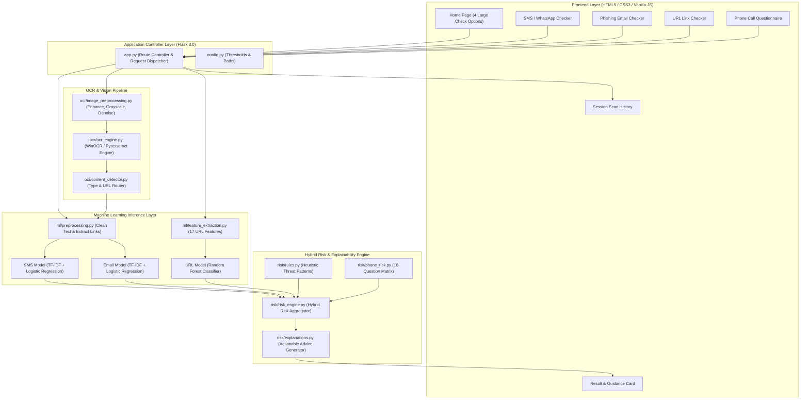

---

### Diagram 2: Overall Workflow

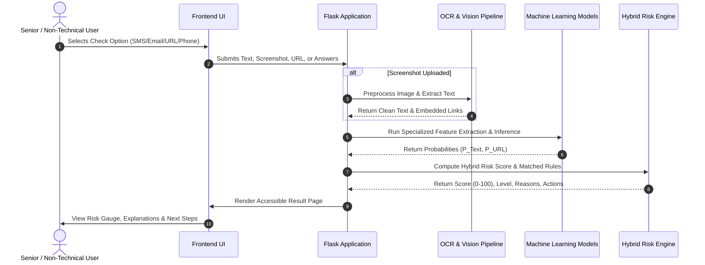

---

### Diagram 3: Context Diagram (Level-0 DFD / Context Model)

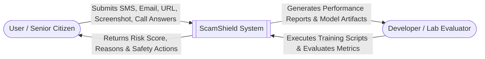

---

### Diagram 4: DFD Level 0 (High-Level Data Flow)

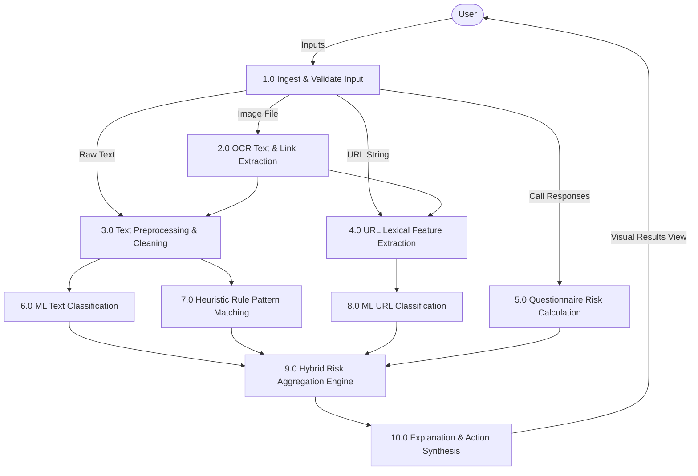

---

### Diagram 5: SMS Workflow

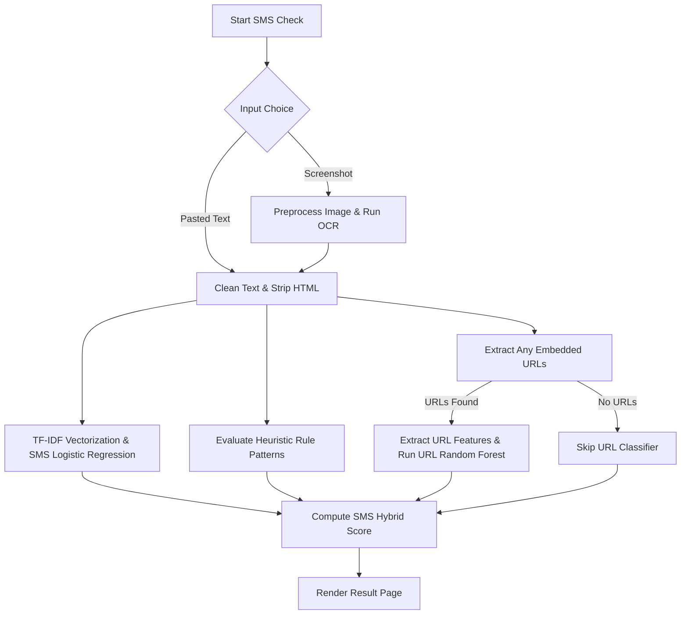

---

### Diagram 6: Email Workflow

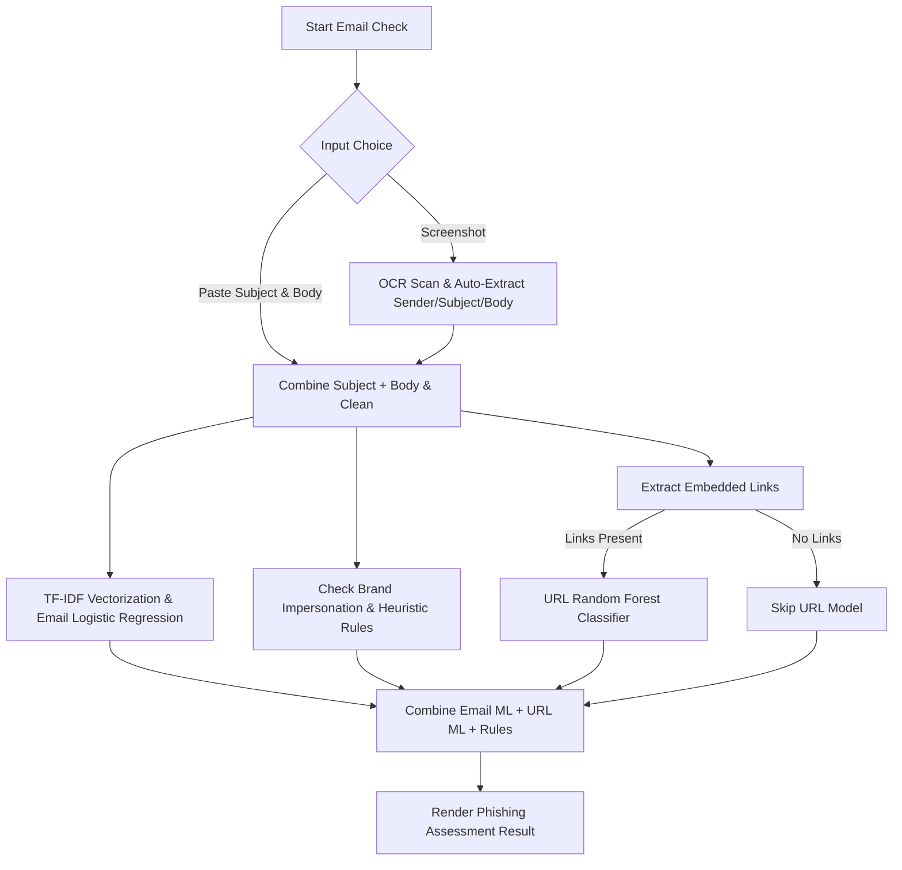

---

### Diagram 7: URL Workflow

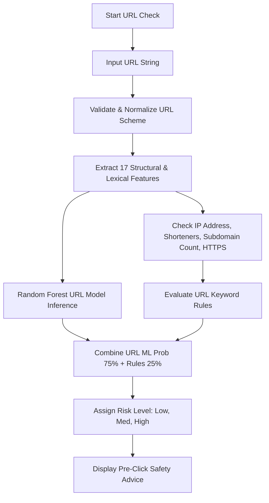

---

### Diagram 8: Screenshot → OCR → Detection Workflow

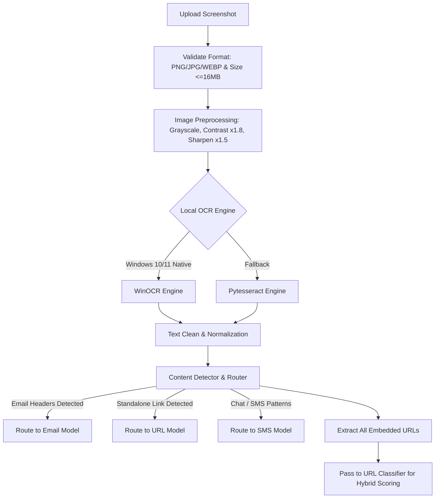

---

### Diagram 9: Phone Questionnaire Workflow

```mermaid
flowchart TD
    A[Start Phone Call Check] --> B[Present 10 Senior-Friendly Questions]
    B --> C[User Selects YES / NO on Each Question Card]
    C --> D[Submit Answers]
    D --> E[Apply Weighted Risk Matrix]
    E -->|OTP / Bank / Password YES| F[High Urgency Triggers (+30 each)]
    E -->|Remote Install / Threats YES| G[Critical Security Triggers (+25 each)]
    E -->|Urgency / Prize YES| H[Social Engineering Triggers (+15 each)]
    F --> I[Sum Total Weighted Points capped at 100]
    G --> I
    H --> I
    I --> J[Map to Risk Level: Low, Medium, High]
    J --> K[Generate Clear Call Safety Checklist]
```

---

### Diagram 10: Risk Score Workflow

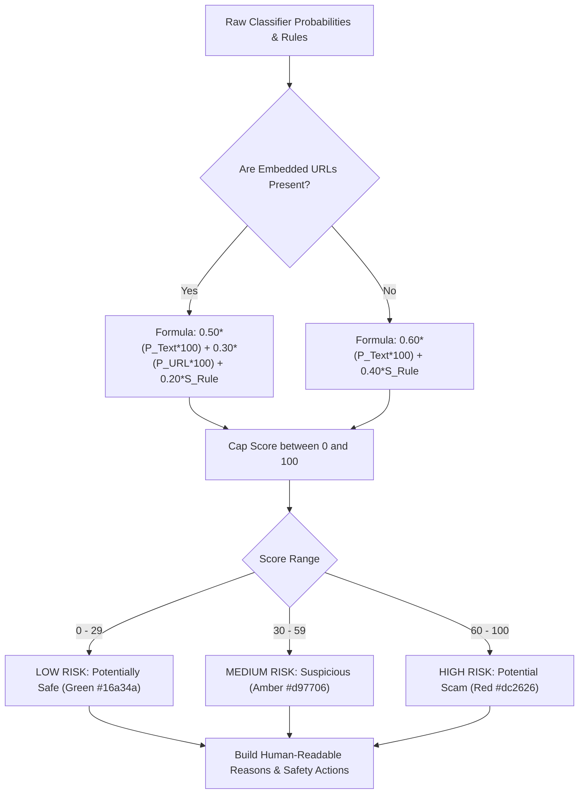

---

### Diagram 11: Use Case Diagram

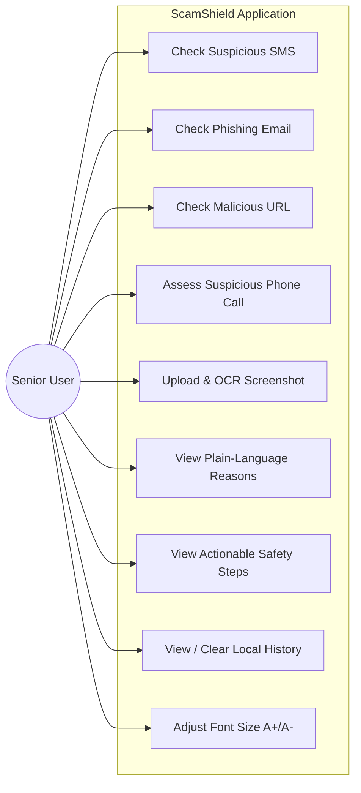

---

### Diagram 12: Session History Data Model (ER / Session Schema)

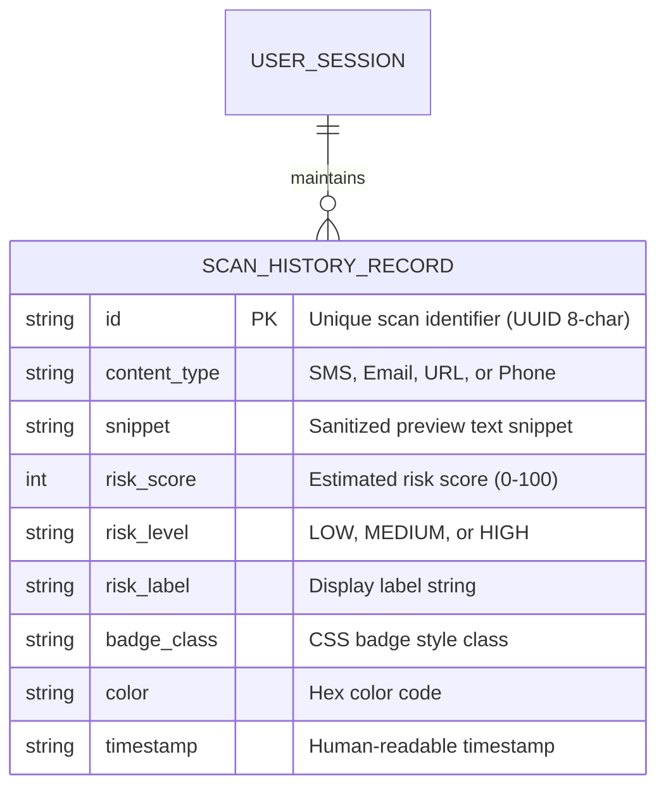

---

### Diagram 13: UI Navigation Flow

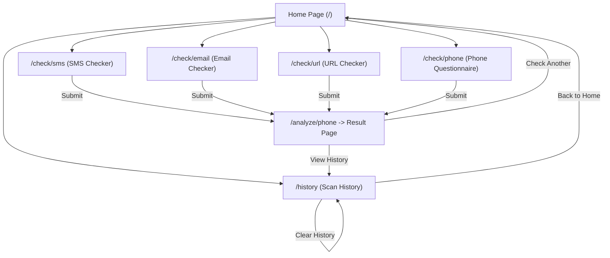

---

### Diagram 14: ML Architecture & Training Flow

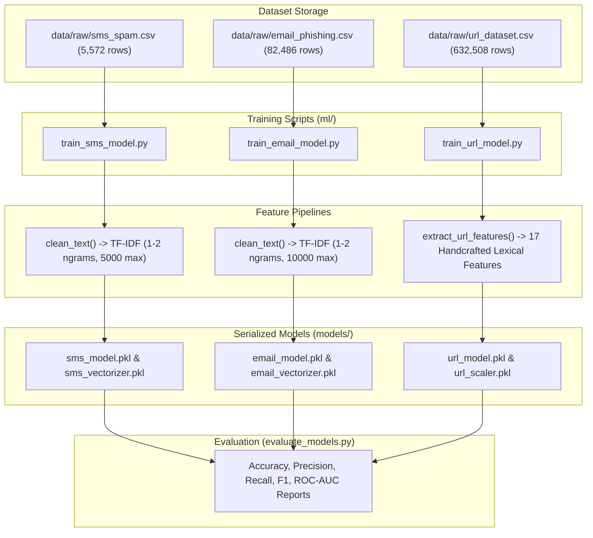
